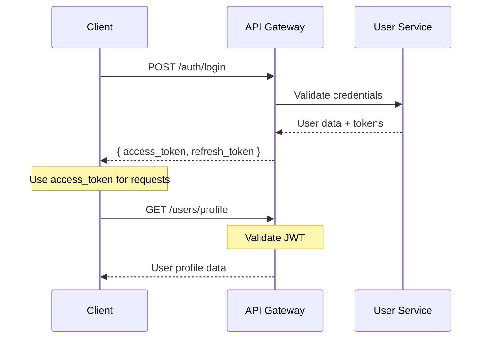

# 🚀 API Documentation - BackupGuard Pro

## 📋 Índice

- [Overview](#overview)
- [Authentication](#authentication)
- [Core APIs](#core-apis)
- [WebSocket Events](#websocket-events)
- [Error Handling](#error-handling)
- [Rate Limiting](#rate-limiting)
- [SDK y Clients](#sdk-y-clients)

## 🎯 Overview

BackupGuard Pro expone una API RESTful completa que permite gestionar todas las funcionalidades del sistema de monitoreo de backups. Todas las APIs siguen los estándares REST y devuelven respuestas en formato JSON.

### Base URL
```
Production:  https://api.backupguard.pro/v1
Staging:     https://staging-api.backupguard.pro/v1
Development: http://localhost:8080/api/v1
```

### Versioning
- **Current Version:** v1
- **Versioning Strategy:** URL Path (`/v1/`, `/v2/`)
- **Deprecation Policy:** 6 months notice for breaking changes

## 🔐 Authentication

### JWT Token Authentication
```http
Authorization: Bearer <jwt_token>
```

### API Key Authentication (para agentes)
```http
X-API-Key: <api_key>
X-Organization-ID: <org_id>
```

### Authentication Flow


### Refresh Token Flow
```typescript
// Automatic token refresh
interface AuthTokens {
  access_token: string;   // 15 minutes lifetime
  refresh_token: string;  // 30 days lifetime
  expires_in: number;
  token_type: "Bearer";
}

// When access token expires
POST /auth/refresh
{
  "refresh_token": "..."
}

// Response
{
  "access_token": "new_jwt_token",
  "expires_in": 900
}
```

## 🏗️ Core APIs

### 1. User Management API

#### Register Organization
```http
POST /auth/register
Content-Type: application/json

{
  "organizationName": "Acme Corp",
  "adminUser": {
    "email": "admin@acme.com",
    "password": "SecurePass123!",
    "firstName": "John",
    "lastName": "Doe",
    "phone": "+1234567890"
  },
  "plan": "professional"
}
```

**Response:**
```json
{
  "success": true,
  "data": {
    "organization": {
      "id": "org_123456789",
      "name": "Acme Corp",
      "plan": "professional",
      "createdAt": "2025-08-16T10:00:00Z"
    },
    "user": {
      "id": "user_123456789",
      "email": "admin@acme.com",
      "role": "admin",
      "organizationId": "org_123456789"
    },
    "tokens": {
      "access_token": "eyJhbGciOiJIUzI1NiIs...",
      "refresh_token": "eyJhbGciOiJIUzI1NiIs...",
      "expires_in": 900
    }
  }
}
```

#### Get User Profile
```http
GET /users/profile
Authorization: Bearer <token>
```

#### Update User Profile
```http
PUT /users/profile
Authorization: Bearer <token>
Content-Type: application/json

{
  "firstName": "Jane",
  "lastName": "Smith",
  "phone": "+0987654321",
  "notificationPreferences": {
    "email": true,
    "sms": false,
    "slack": true
  }
}
```

### 2. Organization Management API

#### Get Organization Details
```http
GET /organizations/current
Authorization: Bearer <token>
```

#### Update Organization Settings
```http
PUT /organizations/current
Authorization: Bearer <token>
Content-Type: application/json

{
  "name": "Acme Corporation",
  "settings": {
    "backupRetentionDays": 90,
    "alertThresholdHours": 24,
    "timezoneOffset": "-05:00"
  }
}
```

#### List Organization Users
```http
GET /organizations/current/users
Authorization: Bearer <token>
```

### 3. Client Management API

#### Register New Client
```http
POST /clients
Authorization: Bearer <token>
Content-Type: application/json

{
  "name": "Production Server 1",
  "description": "Main application server",
  "type": "server",
  "location": "Data Center A",
  "contactPerson": "IT Admin",
  "operatingSystem": "Ubuntu 22.04"
}
```

**Response:**
```json
{
  "success": true,
  "data": {
    "client": {
      "id": "client_123456789",
      "name": "Production Server 1",
      "apiKey": "api_abc123def456ghi789",
      "status": "pending",
      "createdAt": "2025-08-16T10:00:00Z"
    },
    "agentDownload": {
      "linux": "https://releases.backupguard.pro/agent/v1.0.0/linux",
      "windows": "https://releases.backupguard.pro/agent/v1.0.0/windows",
      "macos": "https://releases.backupguard.pro/agent/v1.0.0/macos"
    }
  }
}
```

#### List Clients
```http
GET /clients?status=active&limit=20&offset=0
Authorization: Bearer <token>
```

#### Get Client Details
```http
GET /clients/{clientId}
Authorization: Bearer <token>
```

#### Update Client Configuration
```http
PUT /clients/{clientId}/config
Authorization: Bearer <token>
Content-Type: application/json

{
  "backupPaths": ["/var/backups", "/home/backups"],
  "checkInterval": 3600,
  "alertThresholds": {
    "missedBackupHours": 24,
    "oldBackupDays": 7
  }
}
```

### 4. Backup Monitoring API

#### Report Backup Status (Agent)
```http
POST /backups/report
X-API-Key: <client_api_key>
X-Organization-ID: <org_id>
Content-Type: application/json

{
  "clientId": "client_123456789",
  "backups": [
    {
      "path": "/var/backups/database.sql",
      "size": 1048576,
      "lastModified": "2025-08-16T09:30:00Z",
      "checksum": "sha256:abc123...",
      "type": "database"
    }
  ],
  "systemInfo": {
    "timestamp": "2025-08-16T10:00:00Z",
    "diskUsage": 75.5,
    "memoryUsage": 60.2
  }
}
```

#### Get Backup History
```http
GET /clients/{clientId}/backups?start=2025-08-01&end=2025-08-16&limit=50
Authorization: Bearer <token>
```

#### Get Backup Status Summary
```http
GET /dashboard/backup-status
Authorization: Bearer <token>
```

**Response:**
```json
{
  "success": true,
  "data": {
    "summary": {
      "totalClients": 15,
      "activeClients": 12,
      "clientsWithIssues": 2,
      "lastBackupWithin24h": 10
    },
    "alerts": [
      {
        "id": "alert_123",
        "clientId": "client_456",
        "clientName": "Production Server 2",
        "type": "missed_backup",
        "severity": "high",
        "message": "No backup detected for 36 hours",
        "createdAt": "2025-08-16T08:00:00Z"
      }
    ]
  }
}
```

### 5. Alerting and Notifications API

#### Get Active Alerts
```http
GET /alerts?status=active&severity=high,medium&limit=20
Authorization: Bearer <token>
```

#### Acknowledge Alert
```http
PUT /alerts/{alertId}/acknowledge
Authorization: Bearer <token>
Content-Type: application/json

{
  "note": "Investigating the issue",
  "acknowledgedBy": "user_123456789"
}
```

#### Configure Notification Channels
```http
POST /notifications/channels
Authorization: Bearer <token>
Content-Type: application/json

{
  "type": "slack",
  "name": "IT Team Slack",
  "configuration": {
    "webhookUrl": "https://hooks.slack.com/services/...",
    "channel": "#alerts"
  },
  "alertTypes": ["missed_backup", "old_backup", "system_error"]
}
```

### 6. Reporting API

#### Generate Report
```http
POST /reports/generate
Authorization: Bearer <token>
Content-Type: application/json

{
  "type": "monthly",
  "period": {
    "start": "2025-08-01",
    "end": "2025-08-31"
  },
  "clients": ["client_123", "client_456"],
  "format": "pdf",
  "email": "manager@acme.com"
}
```

#### Download Report
```http
GET /reports/{reportId}/download
Authorization: Bearer <token>
```

## 🔗 WebSocket Events

### Connection
```javascript
const socket = io('wss://api.backupguard.pro', {
  auth: {
    token: 'Bearer <jwt_token>'
  }
});
```

### Client Events

#### Join Organization Room
```javascript
socket.emit('join_organization', {
  organizationId: 'org_123456789'
});
```

#### Subscribe to Client Updates
```javascript
socket.emit('subscribe_client', {
  clientId: 'client_123456789'
});
```

### Server Events

#### Backup Status Update
```javascript
socket.on('backup_status_update', (data) => {
  console.log('Backup update:', data);
  // {
  //   clientId: 'client_123',
  //   status: 'completed',
  //   timestamp: '2025-08-16T10:00:00Z',
  //   details: { ... }
  // }
});
```

#### New Alert
```javascript
socket.on('new_alert', (alert) => {
  console.log('New alert:', alert);
  // {
  //   id: 'alert_123',
  //   type: 'missed_backup',
  //   severity: 'high',
  //   clientId: 'client_456',
  //   message: 'No backup detected for 24 hours'
  // }
});
```

#### Client Status Change
```javascript
socket.on('client_status_change', (data) => {
  console.log('Client status:', data);
  // {
  //   clientId: 'client_123',
  //   status: 'offline',
  //   lastSeen: '2025-08-16T09:45:00Z'
  // }
});
```

## ⚠️ Error Handling

### Error Response Format
```json
{
  "success": false,
  "error": {
    "code": "VALIDATION_ERROR",
    "message": "Invalid input data",
    "details": [
      {
        "field": "email",
        "message": "Invalid email format"
      }
    ],
    "timestamp": "2025-08-16T10:00:00Z",
    "requestId": "req_123456789"
  }
}
```

### Error Codes
| Code | HTTP Status | Description |
|------|-------------|-------------|
| `VALIDATION_ERROR` | 400 | Invalid input data |
| `UNAUTHORIZED` | 401 | Invalid or missing authentication |
| `FORBIDDEN` | 403 | Insufficient permissions |
| `NOT_FOUND` | 404 | Resource not found |
| `CONFLICT` | 409 | Resource already exists |
| `RATE_LIMITED` | 429 | Too many requests |
| `INTERNAL_ERROR` | 500 | Internal server error |
| `SERVICE_UNAVAILABLE` | 503 | Service temporarily unavailable |

## 🚦 Rate Limiting

### Limits by Endpoint Type
| Endpoint Type | Limit | Window |
|---------------|-------|--------|
| Authentication | 10 requests | 1 minute |
| Read Operations | 1000 requests | 1 hour |
| Write Operations | 200 requests | 1 hour |
| Report Generation | 10 requests | 1 hour |
| Agent Reporting | 3600 requests | 1 hour |

### Rate Limit Headers
```http
X-RateLimit-Limit: 1000
X-RateLimit-Remaining: 999
X-RateLimit-Reset: 1629720000
```

## 📚 SDK y Clients

### JavaScript/TypeScript SDK
```bash
npm install @backupguard/sdk
```

```typescript
import { BackupGuardClient } from '@backupguard/sdk';

const client = new BackupGuardClient({
  apiKey: 'your-api-key',
  baseUrl: 'https://api.backupguard.pro/v1'
});

// Get backup status
const status = await client.backups.getStatus('client_123');

// Listen to real-time updates
client.on('backup_status_update', (update) => {
  console.log('Backup update:', update);
});
```

### Python SDK
```bash
pip install backupguard-sdk
```

```python
from backupguard import BackupGuardClient

client = BackupGuardClient(
    api_key='your-api-key',
    base_url='https://api.backupguard.pro/v1'
)

# Get clients
clients = client.clients.list()

# Generate report
report = client.reports.generate(
    type='monthly',
    period={'start': '2025-08-01', 'end': '2025-08-31'}
)
```

### Go SDK (para agentes)
```go
package main

import (
    "github.com/backupguard/go-sdk"
)

func main() {
    client := backupguard.NewClient(&backupguard.Config{
        APIKey: "your-api-key",
        BaseURL: "https://api.backupguard.pro/v1",
    })
    
    // Report backup status
    err := client.Backups.Report(&backupguard.BackupReport{
        ClientID: "client_123",
        Backups: []backupguard.Backup{
            {
                Path: "/var/backups/db.sql",
                Size: 1048576,
                LastModified: time.Now(),
            },
        },
    })
}
```

## 📖 Interactive Documentation

### Swagger/OpenAPI
- **Production:** https://api.backupguard.pro/docs
- **Staging:** https://staging-api.backupguard.pro/docs

### Postman Collection
```bash
# Import our Postman collection
curl -o backupguard-api.json https://api.backupguard.pro/postman-collection
```

---

**Próximos Pasos:**
1. Implementar OpenAPI specifications
2. Crear SDKs para todos los lenguajes
3. Setup interactive documentation
4. Crear ejemplos de integración

*Última actualización: 16 de agosto de 2025*
