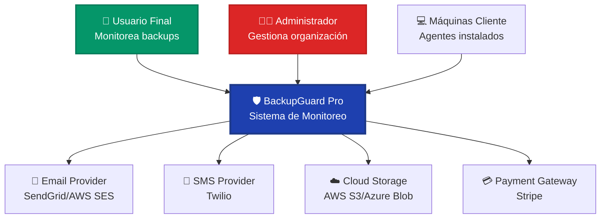
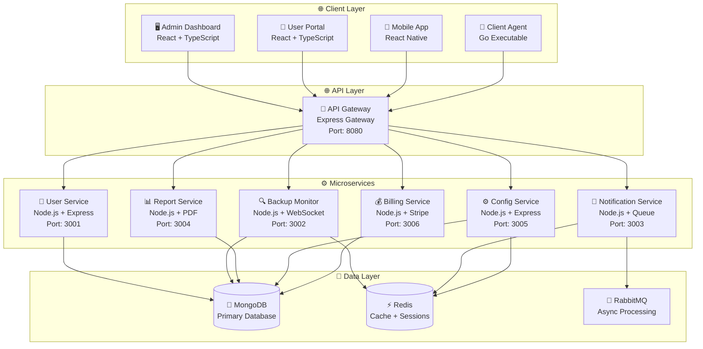
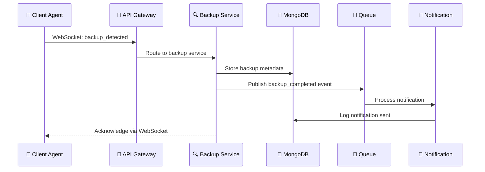
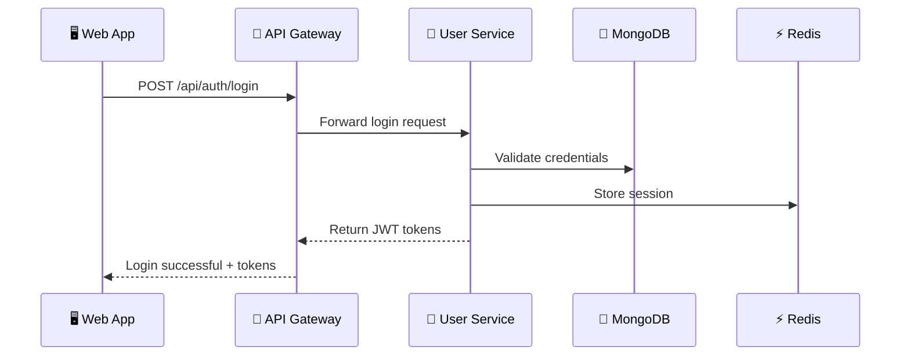

# 🏗️ Arquitectura del Sistema - BackupGuard Pro

## 🎯 Visión General

BackupGuard Pro está construido con una arquitectura de microservicios cloud-native diseñada para ser escalable, resiliente y fácil de mantener. Cada componente del sistema está diseñado para operar independientemente mientras se integra perfectamente con el ecosistema completo.

## 📐 Principios Arquitectónicos

### 1. **Microservicios Independientes**
- Cada servicio puede ser desarrollado, desplegado y escalado independientemente
- Comunicación a través de APIs REST bien definidas
- Base de datos por servicio (Database per Service pattern)

### 2. **Cloud-Native First**
- Containerizado con Docker desde el inicio
- Orquestado con Kubernetes para producción
- Auto-scaling basado en métricas de performance

### 3. **Resiliente por Diseño**
- Circuit breakers para manejo de fallos
- Retry logic con backoff exponencial
- Health checks y self-healing capabilities

### 4. **Observabilidad Completa**
- Logging estructurado con correlación de requests
- Métricas detalladas con Prometheus
- Distributed tracing con Jaeger

## 🏛️ Diagramas C4

### C1 - System Context Diagram


### C2 - Container Diagram


## 🔧 Tecnologías Principales

### Backend Stack
```typescript
interface BackendStack {
  runtime: "Node.js 18+";
  language: "TypeScript";
  framework: "Express.js";
  database: "MongoDB";
  cache: "Redis";
  queue: "RabbitMQ";
  auth: "JWT + Refresh Tokens";
  validation: "Zod";
  orm: "Mongoose";
  websockets: "Socket.io";
  testing: "Jest + Supertest";
}
```

### Frontend Stack
```typescript
interface FrontendStack {
  framework: "React 18";
  language: "TypeScript";
  bundler: "Vite";
  styling: "Tailwind CSS + Radix UI";
  state: "Zustand + React Query";
  routing: "React Router";
  charts: "Recharts";
  realtime: "Socket.io-client";
  testing: "Jest + React Testing Library";
}
```

### Infrastructure Stack
```yaml
infrastructure:
  containers: "Docker"
  orchestration: "Kubernetes"
  cicd: "GitHub Actions"
  monitoring: "Prometheus + Grafana"
  logging: "ELK Stack"
  tracing: "Jaeger"
  security: "Falco + OPA"
  cloud: "Multi-cloud (AWS/Azure/GCP)"
```

## 📊 Patrones de Arquitectura

### 1. **API Gateway Pattern**
- Punto de entrada único para todos los clientes
- Routing inteligente a microservicios
- Cross-cutting concerns (auth, rate limiting, logging)

### 2. **Database per Service**
- Cada microservicio tiene su propia base de datos
- Autonomía de datos y tecnología
- Evita acoplamiento a través de datos compartidos

### 3. **Event-Driven Architecture**
- Comunicación asíncrona entre servicios
- Event sourcing para auditoría
- CQRS para separar comandos de queries

### 4. **Circuit Breaker Pattern**
- Previene cascading failures
- Fallback mechanisms
- Auto-recovery y health monitoring

## 🔐 Seguridad por Diseño

### Autenticación y Autorización
- **JWT Tokens** con vida corta (15 minutos)
- **Refresh Tokens** con vida larga (30 días)
- **Role-Based Access Control** (RBAC)
- **Multi-Factor Authentication** opcional

### Comunicación Segura
- **TLS 1.3** para todas las comunicaciones
- **mTLS** entre microservicios internos
- **API Rate Limiting** por usuario y endpoint
- **CORS** configurado apropiadamente

### Datos y Privacidad
- **Encriptación at rest** con AES-256
- **Encriptación in transit** con TLS
- **GDPR Compliance** desde el diseño
- **Data minimization** y retention policies

## 📈 Escalabilidad y Performance

### Horizontal Scaling
```yaml
scaling_strategy:
  api_gateway: "Load balancer + multiple instances"
  microservices: "Kubernetes HPA based on CPU/Memory"
  database: "MongoDB sharding + read replicas"
  cache: "Redis cluster mode"
  queue: "RabbitMQ cluster"
```

### Performance Targets
| Componente | Target | Medición |
|------------|--------|----------|
| API Response Time | < 200ms | 95th percentile |
| WebSocket Latency | < 50ms | Average |
| Database Queries | < 100ms | 95th percentile |
| Backup Detection | < 5 minutes | Maximum |
| System Uptime | 99.9% | Monthly |

## 🔄 Data Flow Architecture

### Backup Detection Flow


### User Authentication Flow


## 🛠️ Development Workflow

### Microservice Development Cycle
1. **API Design First** - OpenAPI specification
2. **Contract Testing** - Pact between services
3. **Independent Development** - Parallel work streams
4. **Service Integration** - Through API Gateway
5. **End-to-End Testing** - Full system validation

### Deployment Strategy
```yaml
deployment_pipeline:
  - commit: "Feature branch"
  - test: "Unit + Integration tests"
  - build: "Docker image creation"
  - deploy: "Staging environment"
  - validate: "Smoke tests"
  - promote: "Production deployment"
  - monitor: "Health checks + metrics"
```

## 📚 Referencias y Decisiones

### Architecture Decision Records (ADRs)
- **[ADR-001: Microservices Architecture](./adr/001-microservices.md)**
- **[ADR-002: Database per Service](./adr/002-database-per-service.md)**
- **[ADR-003: Event-Driven Communication](./adr/003-event-driven.md)**
- **[ADR-004: Technology Stack Selection](./adr/004-tech-stack.md)**

### Patrones Implementados
- **[Microservices Patterns](./patterns/microservices.md)**
- **[Data Patterns](./patterns/data-patterns.md)**
- **[Security Patterns](./patterns/security-patterns.md)**
- **[Integration Patterns](./patterns/integration-patterns.md)**

---

**Próximos Pasos:**
1. Implementar HU 0 (Diseño Arquitectónico)
2. Crear diagramas C3 (Component level)
3. Definir APIs con OpenAPI/Swagger
4. Setup inicial de microservicios

*Última actualización: 16 de agosto de 2025*
