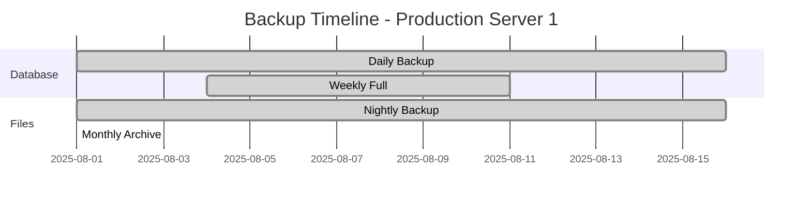

# 👥 User Guide - BackupGuard Pro

## 📋 Índice

- [Getting Started](#getting-started)
- [Dashboard Overview](#dashboard-overview)
- [Client Management](#client-management)
- [Backup Monitoring](#backup-monitoring)
- [Alerts & Notifications](#alerts--notifications)
- [Reports & Analytics](#reports--analytics)
- [User Management](#user-management)
- [Settings & Configuration](#settings--configuration)
- [Mobile App](#mobile-app)
- [Troubleshooting](#troubleshooting)

## 🚀 Getting Started

### Welcome to BackupGuard Pro! 

BackupGuard Pro es la solución líder en monitoreo de copias de seguridad para empresas modernas. Esta guía te ayudará a configurar y usar todas las funcionalidades de la plataforma.

### ✨ Quick Start (5 minutos)

#### 1. **Registro de Organización**
1. Visita [https://backupguard.pro/register](https://backupguard.pro/register)
2. Completa el formulario con los datos de tu organización
3. Elige tu plan (Professional o Enterprise)
4. Confirma tu email para activar la cuenta

#### 2. **Primer Login**
1. Accede al [Dashboard](https://app.backupguard.pro)
2. Usa las credenciales del administrador que creaste
3. Completa el setup wizard de configuración inicial

#### 3. **Agregar tu Primer Cliente**
```bash
# 1. En el dashboard, ve a "Clients" → "Add New Client"
# 2. Completa la información del servidor/workstation
# 3. Descarga el agente para tu sistema operativo:

# Linux
wget https://releases.backupguard.pro/agent/v1.0.0/linux/agent
chmod +x agent
./agent install --api-key=YOUR_API_KEY --org-id=YOUR_ORG_ID

# Windows
# Descarga e instala BackupGuardAgent.msi
# O ejecuta en PowerShell:
.\agent.exe install --api-key=YOUR_API_KEY --org-id=YOUR_ORG_ID

# macOS
curl -O https://releases.backupguard.pro/agent/v1.0.0/macos/agent
chmod +x agent
./agent install --api-key=YOUR_API_KEY --org-id=YOUR_ORG_ID
```

#### 4. **Verificar Funcionamiento**
- En el dashboard verás el cliente como "Online" en 1-2 minutos
- El primer reporte de backups aparecerá automáticamente
- ¡Listo! Ya estás monitoreando tus backups 🎉

## 📊 Dashboard Overview

### Main Dashboard
El dashboard principal te da una vista panorámica de todos tus backups:


#### 📈 Widget Overview
1. **Backup Status Summary**
   - Total de clientes monitoreados
   - Clientes activos vs inactivos
   - Estado de salud general

2. **Recent Alerts**
   - Alertas críticas recientes
   - Backups perdidos o obsoletos
   - Problemas de conectividad

3. **Backup Trends**
   - Gráfico de backups en los últimos 30 días
   - Tendencias de crecimiento de datos
   - Patrones de horarios de backup

4. **System Health**
   - Performance de la plataforma
   - Tiempo de respuesta de agentes
   - Estado de servicios

### Real-time Updates
El dashboard se actualiza en tiempo real usando WebSockets:
- ✅ **Verde**: Backup reciente (< 24 horas)
- ⚠️ **Amarillo**: Backup retrasado (24-48 horas)
- 🔴 **Rojo**: Backup crítico (> 48 horas)
- ⚫ **Gris**: Cliente desconectado

### Customization
Personaliza tu dashboard:
1. **Widgets**: Arrastra y reorganiza widgets
2. **Filtros**: Filtra por ubicación, tipo de cliente, o estado
3. **Timeframes**: Cambia el período de visualización
4. **Themes**: Modo claro/oscuro disponible

## 💻 Client Management

### Adding Clients

#### Información Básica Requerida
```json
{
  "name": "Production Server 1",
  "description": "Main database server",
  "type": "server",
  "location": "Data Center NY",
  "contactPerson": "John Doe",
  "email": "john@company.com",
  "operatingSystem": "Ubuntu 22.04"
}
```

#### Agent Installation

**🐧 Linux (Ubuntu/Debian/CentOS/RHEL)**
```bash
# Download and install
curl -fsSL https://install.backupguard.pro | bash

# Or manual installation
wget https://releases.backupguard.pro/agent/latest/linux/agent
chmod +x agent
sudo ./agent install \
  --api-key=YOUR_API_KEY \
  --org-id=YOUR_ORG_ID \
  --name="Production Server 1"

# Verify installation
sudo systemctl status backupguard-agent
```

**🪟 Windows**
```powershell
# Download and install MSI
Invoke-WebRequest -Uri "https://releases.backupguard.pro/agent/latest/windows/BackupGuardAgent.msi" -OutFile "BackupGuardAgent.msi"
Start-Process msiexec.exe -ArgumentList "/i BackupGuardAgent.msi /quiet" -Wait

# Or using executable
.\BackupGuardAgent.exe install --api-key=YOUR_API_KEY --org-id=YOUR_ORG_ID

# Verify installation
Get-Service BackupGuardAgent
```

**🍎 macOS**
```bash
# Using Homebrew
brew install backupguard/tap/agent

# Or direct download
curl -O https://releases.backupguard.pro/agent/latest/macos/agent
chmod +x agent
sudo ./agent install --api-key=YOUR_API_KEY --org-id=YOUR_ORG_ID

# Verify installation
sudo launchctl list | grep backupguard
```

### Client Configuration

#### Backup Paths
Configura qué directorios monitorear:
```yaml
# Default paths by OS
Windows:
  - "C:\\Backups"
  - "D:\\DatabaseBackups"
  - "C:\\Program Files\\BackupSoftware\\Exports"

Linux:
  - "/var/backups"
  - "/home/backups"
  - "/opt/backups"
  - "/backup"

macOS:
  - "/Users/Shared/Backups"
  - "/Applications/BackupSoftware/Exports"
  - "/Volumes/BackupDrive"
```

#### Check Intervals
```json
{
  "checkInterval": 3600,        // 1 hour (recommended)
  "fastCheckInterval": 300,     // 5 minutes for critical paths
  "reportInterval": 3600,       // 1 hour reporting to server
  "retryInterval": 60          // 1 minute on connection failure
}
```

#### Alert Thresholds
```json
{
  "alertThresholds": {
    "missedBackupHours": 24,     // Alert if no backup for 24h
    "oldBackupDays": 7,          // Alert if backup older than 7 days
    "diskUsagePercent": 90,      // Alert if disk > 90% full
    "connectionTimeoutMinutes": 5 // Alert if agent offline > 5min
  }
}
```

### Client Status & Health

#### Status Indicators
- 🟢 **Online**: Agent conectado y reportando
- 🟡 **Warning**: Problemas menores detectados
- 🔴 **Critical**: Problemas críticos que requieren atención
- ⚫ **Offline**: Agent desconectado

#### Health Metrics
```typescript
interface ClientHealth {
  lastSeen: Date;              // Última vez que reportó
  backupStatus: BackupStatus;  // Estado de backups
  diskUsage: number;           // % de uso de disco
  memoryUsage: number;         // % de uso de memoria
  agentVersion: string;        // Versión del agente
  uptime: number;             // Tiempo de actividad en segundos
}
```

## 🔍 Backup Monitoring

### Backup Detection
BackupGuard Pro detecta automáticamente:
- ✅ **Archivos nuevos** en directorios monitoreados
- ✅ **Cambios en archivos** existentes (timestamp, tamaño)
- ✅ **Tipos de backup** (bases de datos, archivos, imágenes)
- ✅ **Patrones de archivo** (*.sql, *.tar.gz, *.zip, etc.)

### Supported Backup Types

#### Database Backups
```yaml
Supported Formats:
  - MySQL: *.sql, *.sql.gz, *.dump
  - PostgreSQL: *.sql, *.dump, *.tar
  - MongoDB: *.bson, *.archive
  - SQL Server: *.bak, *.trn
  - Oracle: *.dmp, *.exp
```

#### File Backups
```yaml
Supported Formats:
  - Archives: *.tar, *.tar.gz, *.zip, *.7z, *.rar
  - Images: *.img, *.iso, *.vhd, *.vmdk
  - Custom: Configurable patterns
```

#### Cloud Backups
```yaml
Monitoring:
  - AWS S3: Via API integration
  - Azure Blob: Via API integration  
  - Google Cloud Storage: Via API integration
  - Local mounted cloud drives
```

### Backup Timeline
Visualiza el historial completo de backups:



### Advanced Monitoring

#### Backup Validation
```typescript
interface BackupValidation {
  checksumVerification: boolean;    // Verificar integridad SHA256
  sizeValidation: boolean;         // Validar tamaño esperado
  ageValidation: boolean;          // Validar antigüedad máxima
  pathValidation: boolean;         // Validar ubicación esperada
}
```

#### Custom Scripts
Ejecuta scripts personalizados para validación:
```bash
#!/bin/bash
# Script de validación personalizado
# Verifica que el backup de MySQL sea válido

BACKUP_FILE="/var/backups/mysql_$(date +%Y%m%d).sql"

if [ -f "$BACKUP_FILE" ]; then
    # Verificar que el archivo no esté vacío
    if [ -s "$BACKUP_FILE" ]; then
        # Verificar que contenga estructura SQL válida
        if grep -q "CREATE TABLE" "$BACKUP_FILE"; then
            echo "BACKUP_VALID"
            exit 0
        fi
    fi
fi

echo "BACKUP_INVALID"
exit 1
```

## 🚨 Alerts & Notifications

### Alert Types

#### 1. **Missed Backup Alerts**
- 🔴 **Critical**: No backup por > 48 horas
- 🟡 **Warning**: No backup por > 24 horas
- 🔵 **Info**: Backup retrasado por > horario esperado

#### 2. **System Alerts**
- 📡 **Connectivity**: Agent desconectado
- 💾 **Storage**: Espacio en disco bajo
- ⚡ **Performance**: Problemas de rendimiento
- 🔧 **Maintenance**: Actualizaciones disponibles

#### 3. **Business Alerts**
- 📊 **SLA Breach**: Violación de acuerdos de servicio
- 📈 **Trends**: Patrones anómalos detectados
- 💰 **Billing**: Problemas de facturación

### Notification Channels

#### 📧 Email Notifications
```yaml
Configuration:
  provider: "SendGrid"
  templates: "Responsive HTML"
  frequency: "Immediate, Daily Digest, Weekly Summary"
  recipients: "Multiple recipients per alert type"
```

#### 📱 SMS Notifications  
```yaml
Configuration:
  provider: "Twilio"
  international: "Global coverage"
  frequency: "Critical alerts only (recommended)"
  fallback: "Email if SMS fails"
```

#### 💬 Slack Integration
```yaml
Setup:
  1. Install BackupGuard app from Slack App Directory
  2. Authorize access to your workspace
  3. Configure channels for different alert types
  4. Set up custom alert formats

Channels:
  - #alerts-critical: Critical backup failures
  - #alerts-warning: Warning alerts  
  - #alerts-info: General notifications
```

#### 📺 Microsoft Teams
```yaml
Setup:
  1. Add BackupGuard connector to Teams
  2. Configure webhook integration
  3. Customize alert formats and channels

Features:
  - Rich card notifications
  - Action buttons (acknowledge, snooze)
  - Thread conversations for follow-up
```

#### 🔗 Webhook Integration
```typescript
// Custom webhook payload
interface WebhookPayload {
  alertId: string;
  type: AlertType;
  severity: "low" | "medium" | "high" | "critical";
  client: {
    id: string;
    name: string;
    location: string;
  };
  message: string;
  timestamp: string;
  details: Record<string, any>;
}

// Example webhook call
POST https://your-system.com/webhooks/backupguard
{
  "alertId": "alert_123456",
  "type": "missed_backup",
  "severity": "critical",
  "client": {
    "id": "client_789",
    "name": "Production Server 1",
    "location": "Data Center NY"
  },
  "message": "No backup detected for 48 hours",
  "timestamp": "2025-08-16T10:00:00Z",
  "details": {
    "lastBackupTime": "2025-08-14T10:00:00Z",
    "expectedBackupPath": "/var/backups",
    "thresholdHours": 24
  }
}
```

### Alert Management

#### Escalation Rules
```yaml
Escalation_Matrix:
  Level_1: # 0-4 hours
    - Email to primary contact
    - Slack notification to team channel
  
  Level_2: # 4-12 hours  
    - SMS to on-call engineer
    - Email to manager
    - Teams notification to leadership
  
  Level_3: # 12+ hours
    - Phone call to emergency contact
    - Email to C-level executives
    - Webhook to external systems
```

#### Acknowledgment & Resolution
- **Quick Actions**: Acknowledge, snooze, or resolve alerts
- **Notes**: Add context and resolution notes
- **History**: Full audit trail of alert lifecycle
- **Metrics**: MTTR (Mean Time To Resolution) tracking

## 📊 Reports & Analytics

### Standard Reports

#### 1. **Executive Summary**
- 📈 Backup success rate (monthly/quarterly)
- 🎯 SLA compliance metrics
- 💰 Cost analysis and optimization
- 📊 Risk assessment dashboard

#### 2. **Technical Reports**
- 🔧 Detailed backup status by client
- 📅 Backup frequency analysis
- 💾 Storage usage trends
- ⚡ Performance metrics

#### 3. **Compliance Reports**
- 📋 GDPR/HIPAA compliance status
- 🔒 Data retention compliance
- 📝 Audit trail reports
- 🏛️ Regulatory requirement tracking

### Custom Reports

#### Report Builder
```typescript
interface CustomReport {
  name: string;
  description: string;
  filters: {
    dateRange: DateRange;
    clients: string[];
    backupTypes: string[];
    alertTypes: string[];
  };
  groupBy: "client" | "date" | "backup_type" | "location";
  metrics: ReportMetric[];
  format: "pdf" | "csv" | "excel" | "json";
  schedule: ReportSchedule;
}
```

#### Automated Reporting
```yaml
Schedule_Options:
  - Daily: 6 AM local time
  - Weekly: Monday 8 AM
  - Monthly: 1st of month 9 AM
  - Quarterly: 1st of quarter 10 AM
  - Custom: Cron expression support

Delivery_Options:
  - Email: PDF attachment
  - Portal: Download from dashboard
  - API: Programmatic access
  - Cloud: Upload to S3/Azure/GCP
```

### Analytics Dashboard

#### Key Metrics
```typescript
interface AnalyticsMetrics {
  // Availability Metrics
  uptimePercentage: number;        // 99.9%
  backupSuccessRate: number;       // 98.5%
  averageBackupSize: number;       // GB
  
  // Performance Metrics  
  averageDetectionTime: number;    // minutes
  alertResponseTime: number;       // minutes
  systemResponseTime: number;      // milliseconds
  
  // Business Metrics
  clientGrowthRate: number;        // monthly %
  storageGrowthRate: number;       // monthly %
  costPerGB: number;              // USD
}
```

#### Trending Analysis
- 📈 **Growth Trends**: Data growth predictions
- 🔄 **Pattern Recognition**: Backup schedule optimization
- ⚠️ **Anomaly Detection**: Unusual patterns alert
- 💡 **Recommendations**: AI-powered suggestions

## 👥 User Management

### User Roles

#### 🔑 Role-Based Access Control (RBAC)
```yaml
Roles:
  Super_Admin:
    - Full system access
    - User management
    - Billing management
    - Organization settings
  
  Admin:
    - Client management
    - Alert configuration
    - Report generation
    - User management (limited)
  
  Manager:
    - View all clients
    - Generate reports
    - Acknowledge alerts
    - View analytics
  
  Operator:
    - View assigned clients
    - Acknowledge alerts
    - Basic reporting
    - Limited settings
  
  Viewer:
    - Read-only access
    - View dashboards
    - Download reports
    - No configuration changes
```

### User Management Interface

#### Adding Users
1. **Navigate**: Users → Add New User
2. **Information**: Email, name, role, permissions
3. **Notification**: User receives welcome email
4. **Activation**: User sets password and activates account

#### Bulk User Import
```csv
email,firstName,lastName,role,clientAccess
john@company.com,John,Doe,admin,all
jane@company.com,Jane,Smith,operator,"client_1,client_2"
bob@company.com,Bob,Johnson,viewer,all
```

### Security Features

#### 🔐 Authentication Options
- **Local Authentication**: Email/password
- **SSO Integration**: SAML 2.0, OAuth 2.0
- **Multi-Factor Authentication**: TOTP, SMS, Email
- **API Keys**: For programmatic access

#### 🛡️ Security Policies
```yaml
Password_Policy:
  minLength: 12
  requireUppercase: true
  requireLowercase: true
  requireNumbers: true
  requireSpecialChars: true
  maxAge: 90 days
  historyCount: 12

Session_Policy:
  maxDuration: 8 hours
  inactivityTimeout: 30 minutes
  concurrentSessions: 3
  requireReauth: sensitive operations
```

## ⚙️ Settings & Configuration

### Organization Settings

#### General Settings
```yaml
Organization:
  name: "Your Company Name"
  timezone: "America/New_York"
  dateFormat: "MM/dd/yyyy"
  currency: "USD"
  language: "en-US"
```

#### Backup Policies
```yaml
Default_Policies:
  retentionPeriod: 90 days
  alertThreshold: 24 hours
  checkInterval: 1 hour
  reportFrequency: daily
  
Custom_Policies:
  - name: "Critical Systems"
    alertThreshold: 4 hours
    escalationRules: immediate
    
  - name: "Development"
    alertThreshold: 72 hours
    escalationRules: none
```

#### Integration Settings
```yaml
Integrations:
  slack:
    enabled: true
    webhookUrl: "https://hooks.slack.com/..."
    defaultChannel: "#alerts"
  
  teams:
    enabled: true
    connectorId: "abc123..."
  
  email:
    provider: "sendgrid"
    fromAddress: "alerts@yourcompany.com"
    
  sms:
    provider: "twilio"
    enabled: false
```

### Advanced Configuration

#### API Configuration
```yaml
API_Settings:
  rateLimit:
    requests: 1000
    window: 3600 # 1 hour
  
  webhooks:
    retryAttempts: 3
    timeout: 30 seconds
    
  authentication:
    jwtExpiry: 15 minutes
    refreshExpiry: 30 days
```

#### Data Retention
```yaml
Data_Retention:
  backupMetadata: 2 years
  alertHistory: 1 year
  auditLogs: 7 years
  reportData: 5 years
  userActivity: 1 year
```

## 📱 Mobile App

### Features
- 📊 **Dashboard**: Vista móvil del estado de backups
- 🚨 **Alerts**: Notificaciones push en tiempo real
- 👥 **Clients**: Lista y estado de clientes
- 📈 **Reports**: Reportes básicos y métricas
- ⚙️ **Settings**: Configuración de notificaciones

### Download Links
- **iOS**: [App Store](https://apps.apple.com/app/backupguard-pro)
- **Android**: [Google Play](https://play.google.com/store/apps/details?id=com.backupguard.pro)

### Mobile Setup
1. Descarga la app desde tu store
2. Usa las credenciales de tu cuenta web
3. Configura notificaciones push
4. Sincronización automática cada 5 minutos

## 🔧 Troubleshooting

### Common Issues

#### 1. **Agent Not Connecting**
```bash
# Check agent status
sudo systemctl status backupguard-agent

# Check logs
sudo journalctl -u backupguard-agent -f

# Restart agent
sudo systemctl restart backupguard-agent

# Verify network connectivity
curl -I https://api.backupguard.pro/health
```

#### 2. **Backups Not Detected**
- ✅ Verify backup paths in client configuration
- ✅ Check file permissions on backup directories
- ✅ Ensure backup files match expected patterns
- ✅ Verify agent has read access to backup locations

#### 3. **Alert Fatigue**
- 📧 Review alert thresholds and adjust if needed
- 🔇 Use alert grouping to reduce noise
- ⏰ Set quiet hours for non-critical alerts
- 🎯 Fine-tune alert rules for your environment

### Contact Support

#### 📞 Support Channels
- **Email**: support@backupguard.pro
- **Chat**: Available 24/7 in the dashboard
- **Phone**: +1-800-BACKUP-1 (24/7 for Enterprise)
- **Portal**: [https://support.backupguard.pro](https://support.backupguard.pro)

#### 📋 Before Contacting Support
1. Check this troubleshooting guide
2. Review the [Knowledge Base](https://help.backupguard.pro)
3. Gather relevant log files and error messages
4. Note the steps to reproduce the issue

---

**¿Necesitas ayuda adicional?** 

Nuestro equipo de soporte está disponible 24/7 para ayudarte. ¡No dudes en contactarnos!

*Última actualización: 16 de agosto de 2025*
