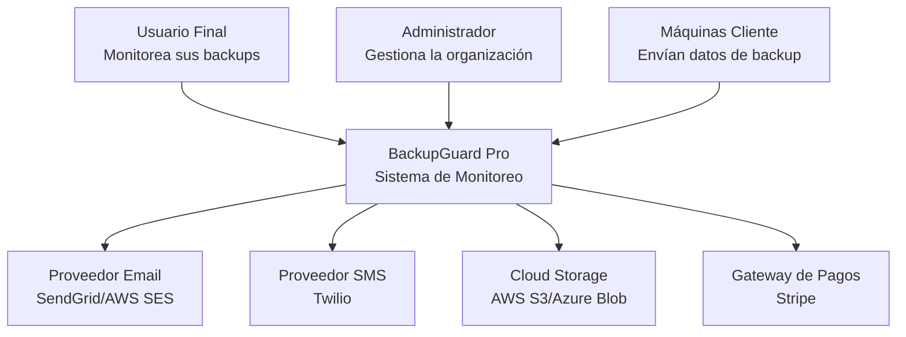
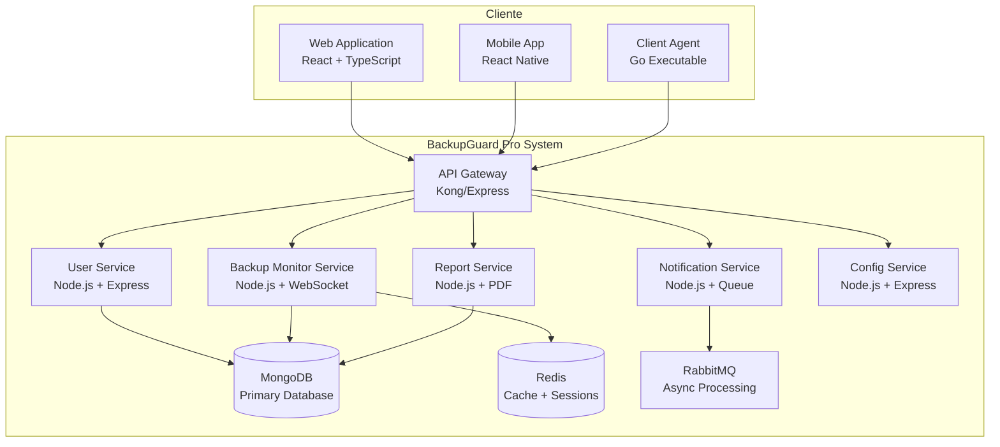

# Historias de Usuario - BackupGuard Pro

## 📋 Información General
- **Proyecto**: Sistema de Monitoreo y Gestión de Copias de Seguridad
- **Metodología**: Shape Up
- **Fecha de Creación**: 16 de agosto de 2025
- **Status General**: En Planificación

---

## 🏗️ HU 0: Diseño Arquitectónico del Sistema (ARQUITECTURA OBLIGATORIA)

### 📊 Estado
- **Status**: 🔴 Pending
- **Prioridad**: Crítica (Bloqueante)
- **Estimación**: 2 semanas
- **Dependencias**: Ninguna
- **Sprint**: Sprint 1

### 📝 Descripción Funcional
**Como** arquitecto de software del proyecto BackupGuard Pro  
**Quiero** diseñar la arquitectura completa del sistema de microservicios  
**Para que** el desarrollo se base en fundamentos sólidos, escalables y bien documentados que guíen todas las decisiones técnicas futuras.

### 🎯 Criterios de Aceptación

#### ✅ AC1: Diagramas C4 Completos
**Dado** que necesitamos documentar la arquitectura del sistema  
**Cuando** complete el diseño arquitectónico  
**Entonces** debe incluir:
- C1 (System Context): Interacción con sistemas externos
- C2 (Container): Todos los microservicios y sus relaciones
- C3 (Component): Detalle interno de servicios críticos
- C4 (Code): Clases principales y patrones de diseño

#### ✅ AC2: Especificación de APIs
**Dado** que los microservicios deben comunicarse entre sí  
**Cuando** defina las interfaces de servicio  
**Entonces** debe especificar:
- Endpoints REST para cada servicio
- Schemas de request/response con Zod
- Códigos de error estandarizados
- Documentación OpenAPI/Swagger

#### ✅ AC3: Modelo de Datos Distribuido
**Dado** que usaremos MongoDB en múltiples servicios  
**Cuando** diseñe el modelo de datos  
**Entonces** debe definir:
- Schemas de MongoDB para cada servicio
- Estrategias de consistencia eventual
- Índices para performance
- Estrategias de backup y recovery

### 🔧 Especificaciones Técnicas

#### Arquitectura de Microservicios
```typescript
interface SystemArchitecture {
  services: {
    apiGateway: {
      technology: "Kong/Express Gateway";
      port: 8080;
      responsibilities: ["routing", "authentication", "rateLimiting"];
    };
    userService: {
      technology: "Node.js + Express + MongoDB";
      port: 3001;
      responsibilities: ["userManagement", "authentication", "organizations"];
    };
    backupMonitorService: {
      technology: "Node.js + Express + MongoDB + WebSocket";
      port: 3002;
      responsibilities: ["backupMonitoring", "integrityValidation", "realTimeAlerts"];
    };
    // ... otros servicios
  };
}
```

#### Diagramas C4

**C1 - System Context**


**C2 - Container Diagram**


### 📋 Tareas de Implementación

- [ ] **Tarea 0.1** (Arquitecto): Crear diagramas C4 completos en Mermaid/Draw.io
- [ ] **Tarea 0.2** (Arquitecto): Definir modelo de datos MongoDB para cada servicio
- [ ] **Tarea 0.3** (Arquitecto): Especificar APIs REST con OpenAPI/Swagger
- [ ] **Tarea 0.4** (Arquitecto): Diseñar estrategia de comunicación entre servicios
- [ ] **Tarea 0.5** (DevOps): Definir arquitectura de deployment y CI/CD
- [ ] **Tarea 0.6** (UX): Crear wireframes y prototipos de UI principales
- [ ] **Tarea 0.7** (Arquitecto): Especificar estrategia de seguridad y autenticación
- [ ] **Tarea 0.8** (DevOps): Definir métricas de monitoreo y observabilidad
- [ ] **Tarea 0.9** (QA): Actualizar documentación del proyecto con nuevos diagramas

---

## 🔐 HU 1: Sistema de Autenticación y Autorización

### 📊 Estado
- **Status**: 🔴 Pending
- **Prioridad**: Alta
- **Estimación**: 1.5 semanas
- **Dependencias**: HU 0 (Arquitectura)
- **Sprint**: Sprint 2

### 📝 Descripción Funcional
**Como** usuario del sistema (administrador o usuario final)  
**Quiero** un sistema de autenticación seguro y una experiencia de login simplificada  
**Para que** pueda acceder a las funcionalidades del sistema de manera segura y sin fricciones.

### 🎯 Criterios de Aceptación

#### ✅ AC1: Registro de Nueva Organización
**Dado** que soy un nuevo usuario que quiere usar BackupGuard  
**Cuando** complete el proceso de registro  
**Entonces** debo poder:
- Crear una cuenta con email y contraseña segura
- Verificar mi email automáticamente
- Acceder inmediatamente a un workspace básico
- Ver tutorial de onboarding

#### ✅ AC2: Autenticación JWT Segura
**Dado** que soy un usuario registrado  
**Cuando** me loguee en el sistema  
**Entonces** debo recibir:
- Access Token JWT (vida: 15 minutos)
- Refresh Token (vida: 30 días, httpOnly cookie)
- Session management en Redis
- Capacidad de logout desde todos los dispositivos

#### ✅ AC3: Gestión de Roles y Permisos
**Dado** que soy administrador de una organización  
**Cuando** gestione usuarios de mi organización  
**Entonces** debo poder:
- Invitar nuevos usuarios por email
- Asignar roles específicos (Admin, Operator, Viewer)
- Definir permisos granulares por funcionalidad
- Revocar acceso instantáneamente

### 🔧 Especificaciones Técnicas

#### Modelo de Datos
```typescript
interface User {
  _id: ObjectId;
  email: string;
  passwordHash: string; // bcrypt con salt rounds 12
  firstName: string;
  lastName: string;
  organizationId: ObjectId;
  role: 'admin' | 'operator' | 'viewer';
  permissions: string[];
  isEmailVerified: boolean;
  emailVerificationToken?: string;
  resetPasswordToken?: string;
  mfaEnabled: boolean;
  mfaSecret?: string;
  createdAt: Date;
  updatedAt: Date;
  lastLoginAt: Date;
}

interface Organization {
  _id: ObjectId;
  name: string;
  domain: string;
  planType: 'free' | 'premium' | 'enterprise';
  ownerId: ObjectId;
  settings: {
    maxUsers: number;
    maxMachines: number;
    features: string[];
    mfaRequired: boolean;
  };
  createdAt: Date;
  updatedAt: Date;
}

interface Session {
  _id: string;
  userId: ObjectId;
  deviceInfo: {
    userAgent: string;
    ip: string;
    location?: string;
  };
  refreshToken: string;
  expiresAt: Date;
  isActive: boolean;
}
```

#### API Endpoints
```typescript
// POST /api/auth/register
interface RegisterRequest {
  email: string;
  password: string;
  firstName: string;
  lastName: string;
  organizationName: string;
}

// POST /api/auth/login
interface LoginRequest {
  email: string;
  password: string;
  mfaCode?: string;
}

interface AuthResponse {
  user: PublicUser;
  organization: PublicOrganization;
  accessToken: string;
  // refreshToken se envía como httpOnly cookie
}
```

### 📋 Tareas de Implementación

- [ ] **Tarea 1.1** (Backend): Crear User Service con estructura base
- [ ] **Tarea 1.2** (Backend): Implementar registro y verificación de email
- [ ] **Tarea 1.3** (Backend): Crear sistema JWT con refresh tokens
- [ ] **Tarea 1.4** (Backend): Implementar middleware de autorización
- [ ] **Tarea 1.5** (Backend): Crear gestión de sesiones con Redis
- [ ] **Tarea 1.6** (Backend): Implementar reset de contraseña
- [ ] **Tarea 1.7** (Backend): Agregar soporte para MFA (opcional)
- [ ] **Tarea 1.8** (QA): Crear tests de seguridad para autenticación
- [ ] **Tarea 1.9** (Docs): Actualizar documentación de APIs de autenticación

---

## 👁️ HU 2: Servicio de Monitoreo de Backups Core

### 📊 Estado
- **Status**: 🔴 Pending
- **Prioridad**: Alta
- **Estimación**: 2 semanas
- **Dependencias**: HU 0 (Arquitectura), HU 1 (Auth)
- **Sprint**: Sprint 2-3

### 📝 Descripción Funcional
**Como** administrador del sistema  
**Quiero** un servicio que monitoree automáticamente el estado de las copias de seguridad en todas las máquinas  
**Para que** pueda tener visibilidad completa y detección proactiva de problemas.

### 🎯 Criterios de Aceptación

#### ✅ AC1: Registro Automático de Máquinas
**Dado** que instalo el agente de BackupGuard en una nueva máquina  
**Cuando** el agente se inicie por primera vez  
**Entonces** debe:
- Auto-registrarse en el sistema central
- Enviar información del sistema (OS, hostname, IP)
- Comenzar heartbeats cada 60 segundos
- Detectar configuraciones de backup existentes

#### ✅ AC2: Monitoreo de Integridad de Backups
**Dado** que una máquina realiza un backup  
**Cuando** el agente detecte el archivo de backup  
**Entonces** debe:
- Calcular checksum SHA-256 del archivo
- Verificar metadata y timestamps
- Validar que el backup esté completo
- Reportar estado al servicio central via WebSocket

#### ✅ AC3: Detección Proactiva de Problemas
**Dado** que una máquina no ha realizado backup en el tiempo esperado  
**Cuando** se exceda el umbral configurado (24h por defecto)  
**Entonces** debe:
- Generar alerta automática de backup faltante
- Clasificar severidad (warning, error, critical)
- Enviar notificación inmediata al notification service
- Actualizar dashboard en tiempo real

### 🔧 Especificaciones Técnicas

#### Modelo de Datos
```typescript
interface Machine {
  _id: ObjectId;
  organizationId: ObjectId;
  name: string;
  hostname: string;
  ipAddress: string;
  operatingSystem: 'windows' | 'linux' | 'macos';
  agentVersion: string;
  status: 'online' | 'offline' | 'warning' | 'error';
  lastHeartbeat: Date;
  lastBackup: Date;
  backupConfig: {
    enabled: boolean;
    schedule: string; // cron expression
    paths: string[];
    retentionDays: number;
    compressionEnabled: boolean;
    expectedMaxSize: number; // bytes
  };
  metrics: {
    cpuUsage: number;
    memoryUsage: number;
    diskSpace: DiskSpaceInfo[];
  };
  createdAt: Date;
  updatedAt: Date;
}

interface BackupExecution {
  _id: ObjectId;
  machineId: ObjectId;
  startTime: Date;
  endTime?: Date;
  status: 'running' | 'completed' | 'failed' | 'cancelled';
  backupType: 'full' | 'incremental' | 'differential';
  filesCount: number;
  totalSize: number;
  compressedSize?: number;
  checksum: string;
  backupPath: string;
  logPath?: string;
  errorMessage?: string;
  performance: {
    duration: number; // seconds
    throughput: number; // MB/s
    compressionRatio?: number;
  };
  createdAt: Date;
}

interface BackupAlert {
  _id: ObjectId;
  machineId: ObjectId;
  organizationId: ObjectId;
  type: 'backup_failed' | 'backup_missing' | 'machine_offline' | 'disk_full';
  severity: 'info' | 'warning' | 'error' | 'critical';
  message: string;
  metadata: Record<string, any>;
  isResolved: boolean;
  resolvedAt?: Date;
  resolvedBy?: ObjectId;
  createdAt: Date;
}
```

#### API Endpoints
```typescript
// WebSocket Events
interface BackupEvent {
  type: 'heartbeat' | 'backup_started' | 'backup_completed' | 'backup_failed';
  machineId: string;
  timestamp: Date;
  data: any;
}

// REST API
// GET /api/machines
interface MachinesResponse {
  machines: Machine[];
  total: number;
  pagination: PaginationInfo;
}

// GET /api/machines/:id/backups
interface BackupHistory {
  backups: BackupExecution[];
  summary: {
    totalBackups: number;
    successRate: number;
    averageDuration: number;
    lastBackup: Date;
  };
}
```

### 📋 Tareas de Implementación

- [ ] **Tarea 2.1** (Backend): Crear Backup Monitor Service con Express + WebSocket
- [ ] **Tarea 2.2** (Backend): Implementar registro y gestión de máquinas
- [ ] **Tarea 2.3** (Backend): Crear sistema de heartbeats y health monitoring
- [ ] **Tarea 2.4** (Backend): Implementar validador de integridad de backups
- [ ] **Tarea 2.5** (Backend): Crear detector de backups faltantes con scheduler
- [ ] **Tarea 2.6** (Backend): Implementar sistema de alertas y clasificación
- [ ] **Tarea 2.7** (Backend): Crear event publisher para notificaciones
- [ ] **Tarea 2.8** (QA): Desarrollar tests de integración para WebSocket
- [ ] **Tarea 2.9** (Docs): Documentar protocolos de comunicación agente-servidor

---

## 🖥️ HU 3: Dashboard de Administración MVP

### 📊 Estado
- **Status**: 🔴 Pending
- **Prioridad**: Alta
- **Estimación**: 2 semanas
- **Dependencias**: HU 1 (Auth), HU 2 (Backup Monitor)
- **Sprint**: Sprint 3-4

### 📝 Descripción Funcional
**Como** administrador  
**Quiero** un dashboard web intuitivo y en tiempo real  
**Para que** pueda visualizar el estado de todas las máquinas y backups de mi organización desde un solo lugar.

### 🎯 Criterios de Aceptación

#### ✅ AC1: Vista General de Estado (Homepage)
**Dado** que accedo al dashboard principal  
**Cuando** la página cargue completamente  
**Entonces** debo ver:
- Resumen ejecutivo con métricas clave del día
- Total de máquinas monitoreadas y su estado
- Backups exitosos/fallidos en las últimas 24 horas
- Gráfico de tendencias de la última semana
- Lista de alertas recientes más importantes

#### ✅ AC2: Monitoreo en Tiempo Real
**Dado** que tengo el dashboard abierto  
**Cuando** ocurra cualquier cambio de estado en las máquinas  
**Entonces** la interfaz debe:
- Actualizarse automáticamente via WebSocket
- Mostrar notificaciones no intrusivas
- Actualizar métricas y gráficos en tiempo real
- Mantener sincronización sin refresh de página

#### ✅ AC3: Vista Detallada de Máquinas
**Dado** que necesito investigar el estado de una máquina específica  
**Cuando** haga clic en una máquina desde la lista  
**Entonces** debo acceder a:
- Historial completo de backups
- Información detallada del sistema
- Logs de eventos y errores
- Configuración de backup actual
- Gráficos de performance y tendencias

### 🔧 Especificaciones Técnicas

#### Stack Frontend
```typescript
// Tecnologías principales
const frontendStack = {
  framework: "React 18",
  language: "TypeScript",
  bundler: "Vite",
  styling: "Tailwind CSS + Radix UI",
  state: "Zustand + React Query",
  routing: "React Router",
  charts: "Recharts",
  websockets: "Socket.io-client",
  forms: "React Hook Form + Zod",
  notifications: "React Hot Toast"
};
```

#### Componentes Principales
```typescript
// Layout Principal
interface DashboardLayoutProps {
  user: User;
  organization: Organization;
  children: React.ReactNode;
}

// Cards de Métricas
interface MetricCardProps {
  title: string;
  value: number | string;
  change: number;
  trend: 'up' | 'down' | 'stable';
  icon: React.ComponentType;
  color: 'green' | 'red' | 'yellow' | 'blue';
}

// Lista de Máquinas
interface MachineListProps {
  machines: Machine[];
  onMachineSelect: (machine: Machine) => void;
  filters: MachineFilters;
  sortBy: MachineSortOptions;
}

// Gráfico de Tendencias
interface BackupTrendChartProps {
  data: BackupTrendData[];
  timeRange: '24h' | '7d' | '30d';
  metric: 'success_rate' | 'backup_count' | 'data_size';
}

// Centro de Notificaciones
interface NotificationCenterProps {
  notifications: BackupAlert[];
  onMarkAsRead: (id: string) => void;
  onMarkAllAsRead: () => void;
}
```

#### Mockup de Dashboard
```
┌─────────────────────────────────────────────────────────────────────┐
│ BackupGuard Pro                    🔔(3) 📊 ⚙️ 👤 Admin           │
├─────────────────────────────────────────────────────────────────────┤
│                                                                     │
│ 📊 Resumen General                          🎯 Estado de Hoy        │
│ ┌─────────────────┐ ┌─────────────────┐    ┌──────────────────────┐ │
│ │ ✅ Saludables   │ │ 🟡 Advertencias │    │ 📈 Tendencia Semanal │ │
│ │      42         │ │       3         │    │ ████████████████████ │ │
│ │   +2 vs ayer    │ │   +1 vs ayer    │    │ 96% éxito promedio   │ │
│ └─────────────────┘ └─────────────────┘    └──────────────────────┘ │
│                                                                     │
│ ┌─────────────────┐ ┌─────────────────┐    ┌──────────────────────┐ │
│ │ 🔴 Críticos     │ │ ⚫ Offline      │    │ 💾 Datos Respaldados │ │
│ │       0         │ │       2         │    │      1.2 TB hoy      │ │
│ │   =  vs ayer    │ │   +1 vs ayer    │    │ +340 GB vs ayer      │ │
│ └─────────────────┘ └─────────────────┘    └──────────────────────┘ │
│                                                                     │
│ 🖥️ Máquinas Recientes                      🚨 Alertas Activas      │
│ ┌─────────────────────────────────────────────────────────────────┐ │
│ │ ✅ SERVER-DB-01    │ Última: 2h ago │ 🟡 SERVER-WEB-02          │ │
│ │ ✅ WORKSTATION-05  │ Última: 4h ago │    Backup retrasado 6h    │ │
│ │ 🟡 SERVER-WEB-02   │ Última: 8h ago │ 🔴 LAPTOP-SALES-01        │ │
│ │ 🔴 LAPTOP-SALES-01 │ Última: 25h    │    Offline por 2 días     │ │
│ └─────────────────────────────────────────────────────────────────┘ │
│                                                                     │
│ [Ver Todas las Máquinas] [Generar Reporte] [Configurar Alertas]    │
└─────────────────────────────────────────────────────────────────────┘
```

### 📋 Tareas de Implementación

- [ ] **Tarea 3.1** (Frontend): Setup proyecto React con Vite y TypeScript
- [ ] **Tarea 3.2** (Frontend): Crear layout base y sistema de navegación
- [ ] **Tarea 3.3** (Frontend): Implementar componentes de métricas y cards
- [ ] **Tarea 3.4** (Frontend): Crear lista de máquinas con filtros y búsqueda
- [ ] **Tarea 3.5** (Frontend): Integrar gráficos de tendencias con Recharts
- [ ] **Tarea 3.6** (Frontend): Implementar WebSocket para updates en tiempo real
- [ ] **Tarea 3.7** (Frontend): Crear páginas de detalle de máquinas
- [ ] **Tarea 3.8** (Frontend): Implementar centro de notificaciones
- [ ] **Tarea 3.9** (QA): Crear tests E2E para flujos principales del dashboard

---

## 🔔 HU 4: Sistema de Notificaciones Básicas

### 📊 Estado
- **Status**: 🔴 Pending
- **Prioridad**: Media
- **Estimación**: 1.5 semanas
- **Dependencias**: HU 2 (Backup Monitor)
- **Sprint**: Sprint 4

### 📝 Descripción Funcional
**Como** usuario del sistema  
**Quiero** recibir notificaciones automáticas sobre el estado de mis backups  
**Para que** pueda reaccionar rápidamente ante problemas y mantenerme informado del estado general.

### 🎯 Criterios de Aceptación

#### ✅ AC1: Notificaciones por Email Automáticas
**Dado** que soy usuario con notificaciones de email habilitadas  
**Cuando** ocurra un evento crítico en mis backups  
**Entonces** debo recibir:
- Email automático dentro de 5 minutos del evento
- Subject line descriptivo del problema
- Información detallada del problema y máquina afectada
- Enlaces directos para acceder al dashboard
- Botón de "Marcar como Resuelto"

#### ✅ AC2: Notificaciones Push en Dashboard
**Dado** que tengo el dashboard abierto en mi navegador  
**Cuando** ocurra cualquier evento relevante  
**Entonces** debo ver:
- Notificación toast no intrusiva en la esquina
- Icono de notificación con counter en la navbar
- Lista de notificaciones en el notification center
- Opción de marcar como leída individualmente

#### ✅ AC3: Configuración de Preferencias
**Dado** que quiero personalizar mis notificaciones  
**Cuando** acceda a la configuración de notificaciones  
**Entonces** debo poder:
- Elegir tipos de eventos que quiero recibir
- Configurar canales (email, push, SMS futuro)
- Establecer frecuencia (inmediato, resumen horario/diario)
- Configurar horarios de silencio (no molestar)

### 🔧 Especificaciones Técnicas

#### Modelo de Datos
```typescript
interface NotificationEvent {
  _id: ObjectId;
  organizationId: ObjectId;
  type: 'backup_completed' | 'backup_failed' | 'machine_offline' | 'storage_full' | 'backup_missing';
  severity: 'info' | 'warning' | 'error' | 'critical';
  title: string;
  message: string;
  machineId?: ObjectId;
  metadata: {
    machineName?: string;
    backupId?: string;
    errorDetails?: string;
    duration?: number;
    fileSize?: number;
  };
  recipients: ObjectId[]; // user IDs
  deliveryStatus: {
    email: 'pending' | 'sent' | 'delivered' | 'failed';
    push: 'pending' | 'sent' | 'delivered' | 'failed';
    sms?: 'pending' | 'sent' | 'delivered' | 'failed';
  };
  createdAt: Date;
  scheduledFor?: Date;
}

interface UserNotificationPreference {
  userId: ObjectId;
  eventTypes: {
    backup_completed: boolean;
    backup_failed: boolean;
    machine_offline: boolean;
    storage_full: boolean;
    backup_missing: boolean;
  };
  channels: {
    email: boolean;
    push: boolean;
    sms: boolean;
  };
  frequency: 'immediate' | 'hourly_digest' | 'daily_digest';
  quietHours: {
    enabled: boolean;
    startTime: string; // "22:00"
    endTime: string;   // "08:00"
    timezone: string;
  };
  isEnabled: boolean;
  createdAt: Date;
  updatedAt: Date;
}
```

#### Email Templates
```typescript
interface EmailTemplate {
  type: 'backup_failed' | 'backup_missing' | 'machine_offline';
  subject: string;
  htmlTemplate: string;
  textTemplate: string;
  variables: string[]; // placeholders like {{machineName}}
}

// Ejemplo de template
const backupFailedTemplate: EmailTemplate = {
  type: 'backup_failed',
  subject: '🚨 Backup Failed - {{machineName}}',
  htmlTemplate: `
    <h2>Backup Failed on {{machineName}}</h2>
    <p>The backup process failed on {{machineName}} at {{timestamp}}.</p>
    <p><strong>Error:</strong> {{errorMessage}}</p>
    <a href="{{dashboardUrl}}" style="background: #007bff; color: white; padding: 10px 20px;">
      View Details
    </a>
  `,
  textTemplate: `
    Backup Failed on {{machineName}}
    
    The backup process failed at {{timestamp}}.
    Error: {{errorMessage}}
    
    View details: {{dashboardUrl}}
  `,
  variables: ['machineName', 'timestamp', 'errorMessage', 'dashboardUrl']
};
```

### 📋 Tareas de Implementación

- [ ] **Tarea 4.1** (Backend): Crear Notification Service con queue processing
- [ ] **Tarea 4.2** (Backend): Implementar integración con SendGrid/AWS SES
- [ ] **Tarea 4.3** (Backend): Crear sistema de templates de email con Handlebars
- [ ] **Tarea 4.4** (Backend): Implementar push notifications via WebSocket
- [ ] **Tarea 4.5** (Backend): Crear gestión de preferencias de usuario
- [ ] **Tarea 4.6** (Backend): Implementar rate limiting y anti-spam
- [ ] **Tarea 4.7** (Frontend): Crear notification center en dashboard
- [ ] **Tarea 4.8** (Frontend): Implementar configuración de preferencias
- [ ] **Tarea 4.9** (QA): Crear tests para diferentes tipos de notificaciones

---

## 🤖 HU 5: Agente Cliente Básico

### 📊 Estado
- **Status**: 🔴 Pending
- **Prioridad**: Alta
- **Estimación**: 2.5 semanas
- **Dependencias**: HU 2 (Backup Monitor)
- **Sprint**: Sprint 4-5

### 📝 Descripción Funcional
**Como** usuario que necesita monitorear backups en mis máquinas  
**Quiero** un agente ligero y fácil de instalar  
**Para que** mis máquinas se conecten automáticamente al sistema central sin configuración compleja.

### 🎯 Criterios de Aceptación

#### ✅ AC1: Instalación One-Click Multiplataforma
**Dado** que descargo el installer de BackupGuard  
**Cuando** ejecute el archivo de instalación  
**Entonces** debe:
- Completar instalación en menos de 60 segundos
- Auto-detectar el sistema operativo (Windows/Linux/macOS)
- Registrarse automáticamente con el servidor central
- Iniciarse como servicio del sistema
- Mostrar wizard de configuración básica

#### ✅ AC2: Detección Automática de Backups
**Dado** que tengo software de backup existente instalado  
**Cuando** el agente se active por primera vez  
**Entonces** debe:
- Detectar configuraciones de Windows Backup
- Detectar Time Machine en macOS
- Identificar herramientas comunes de backup en Linux
- Sugerir carpetas importantes para monitorear
- Permitir configuración manual adicional

#### ✅ AC3: Comunicación Resiliente
**Dado** que la máquina puede tener conectividad intermitente  
**Cuando** se pierda la conexión temporalmente  
**Entonces** el agente debe:
- Almacenar eventos localmente en SQLite
- Continuar monitoreando archivos offline
- Reintentar conexión automáticamente
- Sincronizar datos acumulados al reconectarse
- Mantener heartbeat cada 60 segundos cuando esté online

### 🔧 Especificaciones Técnicas

#### Arquitectura del Agente (Go)
```go
// Estructura principal del agente
type BackupAgent struct {
    Config       *AgentConfig
    HTTPClient   *http.Client
    WebSocket    *websocket.Conn
    LocalDB      *sql.DB
    FileWatcher  *fsnotify.Watcher
    Scheduler    *cron.Cron
    Logger       *logrus.Logger
}

type AgentConfig struct {
    ServerURL     string `json:"server_url"`
    APIKey        string `json:"api_key"`
    MachineID     string `json:"machine_id"`
    Organization  string `json:"organization"`
    MonitorPaths  []string `json:"monitor_paths"`
    BackupTools   []BackupTool `json:"backup_tools"`
    HeartbeatInterval int `json:"heartbeat_interval"` // seconds
}

type BackupEvent struct {
    ID           string    `json:"id"`
    Timestamp    time.Time `json:"timestamp"`
    Type         string    `json:"type"` // "started", "completed", "failed"
    Path         string    `json:"path"`
    Size         int64     `json:"size"`
    Checksum     string    `json:"checksum"`
    Duration     int       `json:"duration"` // seconds
    ErrorMessage string    `json:"error_message,omitempty"`
    Metadata     map[string]interface{} `json:"metadata"`
}
```

#### Funcionalidades Core
```go
// Detección de herramientas de backup
func (a *BackupAgent) DetectBackupTools() []BackupTool {
    var tools []BackupTool
    
    switch runtime.GOOS {
    case "windows":
        tools = append(tools, a.detectWindowsBackup()...)
        tools = append(tools, a.detectCommonTools()...)
    case "darwin":
        tools = append(tools, a.detectTimeMachine()...)
        tools = append(tools, a.detectCommonTools()...)
    case "linux":
        tools = append(tools, a.detectLinuxTools()...)
    }
    
    return tools
}

// Monitoreo de archivos
func (a *BackupAgent) StartFileWatcher() error {
    watcher, err := fsnotify.NewWatcher()
    if err != nil {
        return err
    }
    
    for _, path := range a.Config.MonitorPaths {
        err = watcher.Add(path)
        if err != nil {
            a.Logger.Warnf("Failed to watch path %s: %v", path, err)
        }
    }
    
    go a.processFileEvents(watcher)
    return nil
}

// Cálculo de checksum
func (a *BackupAgent) CalculateChecksum(filePath string) (string, error) {
    file, err := os.Open(filePath)
    if err != nil {
        return "", err
    }
    defer file.Close()
    
    hash := sha256.New()
    if _, err := io.Copy(hash, file); err != nil {
        return "", err
    }
    
    return fmt.Sprintf("%x", hash.Sum(nil)), nil
}
```

#### Instalador Multiplataforma
```bash
# Windows (PowerShell)
Invoke-WebRequest -Uri "https://releases.backupguard.pro/latest/windows/installer.exe" -OutFile "installer.exe"
.\installer.exe /S /organization="MyCompany" /server="https://api.backupguard.pro"

# macOS (Homebrew)
brew install backupguard/tap/backupguard-agent
backupguard-agent setup --organization="MyCompany"

# Linux (curl + bash)
curl -fsSL https://install.backupguard.pro | bash -s -- --org="MyCompany"
```

### 📋 Tareas de Implementación

- [ ] **Tarea 5.1** (Backend/Go): Crear estructura base del agente en Go
- [ ] **Tarea 5.2** (Backend/Go): Implementar comunicación WebSocket bidireccional
- [ ] **Tarea 5.3** (Backend/Go): Crear sistema de detección de backup tools
- [ ] **Tarea 5.4** (Backend/Go): Implementar file system monitoring con fsnotify
- [ ] **Tarea 5.5** (Backend/Go): Crear cache local con SQLite para offline mode
- [ ] **Tarea 5.6** (DevOps): Crear instaladores para Windows, macOS, Linux
- [ ] **Tarea 5.7** (Backend/Go): Implementar sistema de auto-actualización
- [ ] **Tarea 5.8** (Backend/Go): Crear configuración via archivo y CLI
- [ ] **Tarea 5.9** (QA): Testing en múltiples sistemas operativos

---

## 🌐 HU 6: API Gateway y Orquestación

### 📊 Estado
- **Status**: 🔴 Pending
- **Prioridad**: Media
- **Estimación**: 1.5 semanas
- **Dependencias**: HU 1 (Auth), HU 2 (Backup Monitor)
- **Sprint**: Sprint 3

### 📝 Descripción Funcional
**Como** arquitecto del sistema  
**Quiero** un API Gateway que centralice el acceso a todos los microservicios  
**Para que** tengamos un punto de entrada único, autenticación centralizada y capacidades de monitoring unificadas.

### 🎯 Criterios de Aceptación

#### ✅ AC1: Routing Inteligente y Load Balancing
**Dado** que un cliente hace una request a cualquier endpoint  
**Cuando** la request llegue al API Gateway  
**Entonces** debe:
- Rutear automáticamente al microservicio correcto
- Aplicar load balancing entre instancias
- Manejar circuit breaker para servicios caídos
- Retornar respuestas consistentes con códigos de error estándar

#### ✅ AC2: Autenticación y Autorización Centralizada
**Dado** que llega una request que requiere autenticación  
**Cuando** el gateway procese la request  
**Entonces** debe:
- Validar JWT tokens automáticamente
- Verificar permisos basados en roles
- Pasar información de usuario a microservicios
- Manejar refresh de tokens automáticamente

#### ✅ AC3: Rate Limiting y Throttling
**Dado** que un usuario/IP hace muchas requests  
**Cuando** exceda los límites configurados  
**Entonces** debe:
- Aplicar rate limiting por usuario y por IP
- Retornar HTTP 429 con headers informativos
- Implementar diferentes límites por plan (free/premium)
- Permitir burst requests dentro de límites

### 🔧 Especificaciones Técnicas

#### Configuración del Gateway
```typescript
// Express Gateway Configuration
interface GatewayConfig {
  http: {
    port: 8080;
    hostname: '0.0.0.0';
  };
  apiEndpoints: {
    userAPI: {
      host: 'localhost';
      paths: ['/api/auth/*', '/api/users/*', '/api/organizations/*'];
    };
    backupAPI: {
      host: 'localhost';  
      paths: ['/api/machines/*', '/api/backups/*', '/api/alerts/*'];
    };
    notificationAPI: {
      host: 'localhost';
      paths: ['/api/notifications/*', '/api/preferences/*'];
    };
  };
  serviceEndpoints: {
    userService: {
      url: 'http://user-service:3001';
    };
    backupService: {
      url: 'http://backup-service:3002';
    };
    notificationService: {
      url: 'http://notification-service:3003';
    };
  };
}
```

#### Middleware Stack
```typescript
// Middleware de autenticación
const authMiddleware = async (req: Request, res: Response, next: NextFunction) => {
  try {
    const token = extractTokenFromHeader(req);
    const payload = await verifyJWT(token);
    req.user = payload;
    req.headers['x-user-id'] = payload.id;
    req.headers['x-organization-id'] = payload.organizationId;
    next();
  } catch (error) {
    return res.status(401).json({ error: 'Invalid authentication token' });
  }
};

// Rate limiting middleware  
const rateLimitMiddleware = rateLimit({
  windowMs: 15 * 60 * 1000, // 15 minutes
  max: (req: Request) => {
    const user = req.user as any;
    return user?.plan === 'premium' ? 1000 : 100; // requests per window
  },
  message: {
    error: 'Too many requests',
    retryAfter: '15 minutes'
  },
  standardHeaders: true,
  legacyHeaders: false,
});

// Circuit breaker middleware
const circuitBreakerMiddleware = (serviceName: string) => {
  const breaker = new CircuitBreaker(proxyToService, {
    timeout: 5000,
    errorThresholdPercentage: 50,
    resetTimeout: 30000
  });
  
  return async (req: Request, res: Response, next: NextFunction) => {
    try {
      const response = await breaker.fire(serviceName, req);
      res.json(response);
    } catch (error) {
      res.status(503).json({ 
        error: 'Service temporarily unavailable',
        service: serviceName 
      });
    }
  };
};
```

### 📋 Tareas de Implementación

- [ ] **Tarea 6.1** (DevOps): Setup y configuración de Express Gateway
- [ ] **Tarea 6.2** (Backend): Configurar service discovery y health checks
- [ ] **Tarea 6.3** (Backend): Implementar middleware de autenticación JWT
- [ ] **Tarea 6.4** (Backend): Configurar rate limiting por usuario y plan
- [ ] **Tarea 6.5** (Backend): Implementar circuit breaker pattern
- [ ] **Tarea 6.6** (DevOps): Configurar logging y métricas centralizadas
- [ ] **Tarea 6.7** (Backend): Crear sistema de health monitoring
- [ ] **Tarea 6.8** (QA): Crear tests de carga para el gateway
- [ ] **Tarea 6.9** (Docs): Documentar configuración y troubleshooting

---

## 🚀 HU 7: Infraestructura y Deployment Base

### 📊 Estado
- **Status**: 🔴 Pending
- **Prioridad**: Media
- **Estimación**: 2 semanas
- **Dependencias**: Todas las HUs anteriores
- **Sprint**: Sprint 5-6

### 📝 Descripción Funcional
**Como** DevOps engineer  
**Quiero** una infraestructura automatizada y reproducible  
**Para que** podamos deployar, escalar y mantener el sistema de manera eficiente y confiable en producción.

### 🎯 Criterios de Aceptación

#### ✅ AC1: Deployment Automatizado
**Dado** que se hace push a la rama main  
**Cuando** el CI/CD pipeline se active  
**Entonces** debe:
- Ejecutar todos los tests (unit, integration, E2E)
- Construir containers Docker para cada servicio
- Deployar automáticamente a staging
- Ejecutar smoke tests en staging
- Permitir promoción manual a producción

#### ✅ AC2: Rollback Rápido y Seguro
**Dado** que se detecta un problema en producción  
**Cuando** se active el proceso de rollback  
**Entonces** debe:
- Revertir a la versión anterior en menos de 2 minutos
- Mantener la integridad de la base de datos
- Notificar automáticamente al equipo
- Generar logs detallados del proceso

#### ✅ AC3: Escalado Automático Basado en Demanda
**Dado** que el sistema experimenta alta carga  
**Cuando** las métricas excedan umbrales definidos  
**Entonces** debe:
- Escalar horizontalmente los pods automáticamente
- Balancear carga entre instancias nuevas
- Monitorear métricas de performance continuamente
- Escalar hacia abajo cuando la demanda disminuya

### 🔧 Especificaciones Técnicas

#### Stack de Infraestructura
```yaml
# docker-compose.yml para desarrollo
version: '3.8'
services:
  api-gateway:
    build: ./services/api-gateway
    ports: ["8080:8080"]
    environment:
      - NODE_ENV=development
      - REDIS_URL=redis://redis:6379
      - USER_SERVICE_URL=http://user-service:3001
    depends_on: [redis, user-service]
    
  user-service:
    build: ./services/user-service  
    ports: ["3001:3001"]
    environment:
      - NODE_ENV=development
      - MONGODB_URL=mongodb://mongo:27017/backupguard
      - JWT_SECRET=${JWT_SECRET}
    depends_on: [mongodb]
    
  backup-service:
    build: ./services/backup-monitor-service
    ports: ["3002:3002", "8000:8000"]
    environment:
      - NODE_ENV=development  
      - MONGODB_URL=mongodb://mongo:27017/backupguard
      - WEBSOCKET_PORT=8000
    depends_on: [mongodb, redis, rabbitmq]
```

#### Kubernetes Manifests
```yaml
# deployment.yaml
apiVersion: apps/v1
kind: Deployment
metadata:
  name: user-service
spec:
  replicas: 3
  selector:
    matchLabels:
      app: user-service
  template:
    metadata:
      labels:
        app: user-service
    spec:
      containers:
      - name: user-service
        image: backupguard/user-service:latest
        ports:
        - containerPort: 3001
        env:
        - name: MONGODB_URL
          valueFrom:
            secretKeyRef:
              name: mongodb-secret
              key: connection-string
        - name: JWT_SECRET
          valueFrom:
            secretKeyRef:
              name: jwt-secret
              key: secret
        resources:
          requests:
            memory: "256Mi"
            cpu: "250m"
          limits:
            memory: "512Mi" 
            cpu: "500m"
        livenessProbe:
          httpGet:
            path: /health
            port: 3001
          initialDelaySeconds: 30
          periodSeconds: 10
        readinessProbe:
          httpGet:
            path: /ready
            port: 3001
          initialDelaySeconds: 5
          periodSeconds: 5

---
apiVersion: v1
kind: Service
metadata:
  name: user-service
spec:
  selector:
    app: user-service
  ports:
  - port: 3001
    targetPort: 3001
  type: ClusterIP

---
apiVersion: autoscaling/v2
kind: HorizontalPodAutoscaler
metadata:
  name: user-service-hpa
spec:
  scaleTargetRef:
    apiVersion: apps/v1
    kind: Deployment
    name: user-service
  minReplicas: 2
  maxReplicas: 10
  metrics:
  - type: Resource
    resource:
      name: cpu
      target:
        type: Utilization
        averageUtilization: 70
  - type: Resource
    resource:
      name: memory
      target:
        type: Utilization
        averageUtilization: 80
```

#### GitHub Actions CI/CD
```yaml
# .github/workflows/ci-cd.yml
name: CI/CD Pipeline
on:
  push:
    branches: [main, develop]
  pull_request:
    branches: [main]

jobs:
  test:
    runs-on: ubuntu-latest
    services:
      mongodb:
        image: mongo:7.0
        ports: ["27017:27017"]
      redis:
        image: redis:7.2
        ports: ["6379:6379"]
        
    steps:
      - uses: actions/checkout@v4
      - uses: actions/setup-node@v4
        with:
          node-version: '18'
          cache: 'npm'
          
      - name: Install dependencies
        run: npm ci
        
      - name: Run unit tests
        run: npm run test:unit
        
      - name: Run integration tests  
        run: npm run test:integration
        
      - name: Upload coverage
        uses: codecov/codecov-action@v3
        
  build:
    needs: test
    runs-on: ubuntu-latest
    if: github.ref == 'refs/heads/main'
    
    steps:
      - uses: actions/checkout@v4
      - name: Build and push Docker images
        run: |
          echo ${{ secrets.DOCKER_PASSWORD }} | docker login -u ${{ secrets.DOCKER_USERNAME }} --password-stdin
          docker build -t backupguard/user-service:${{ github.sha }} ./services/user-service
          docker push backupguard/user-service:${{ github.sha }}
          
  deploy-staging:
    needs: build
    runs-on: ubuntu-latest
    environment: staging
    
    steps:
      - name: Deploy to staging
        run: |
          kubectl set image deployment/user-service user-service=backupguard/user-service:${{ github.sha }}
          kubectl rollout status deployment/user-service
          
      - name: Run smoke tests
        run: npm run test:smoke -- --env=staging
        
  deploy-production:
    needs: deploy-staging
    runs-on: ubuntu-latest
    environment: production
    if: github.ref == 'refs/heads/main'
    
    steps:
      - name: Deploy to production
        run: |
          kubectl set image deployment/user-service user-service=backupguard/user-service:${{ github.sha }}
          kubectl rollout status deployment/user-service
```

### 📋 Tareas de Implementación

- [ ] **Tarea 7.1** (DevOps): Crear Dockerfiles optimizados para cada microservicio
- [ ] **Tarea 7.2** (DevOps): Setup de docker-compose para desarrollo local
- [ ] **Tarea 7.3** (DevOps): Configurar GitHub Actions para CI/CD completo
- [ ] **Tarea 7.4** (DevOps): Crear manifiestos de Kubernetes para todos los servicios
- [ ] **Tarea 7.5** (DevOps): Setup de Prometheus y Grafana para monitoring
- [ ] **Tarea 7.6** (DevOps): Configurar ELK stack para centralized logging
- [ ] **Tarea 7.7** (DevOps): Implementar health checks y readiness probes
- [ ] **Tarea 7.8** (DevOps): Crear scripts de rollback automatizado
- [ ] **Tarea 7.9** (QA): Testing de infraestructura y disaster recovery

---

## 📊 Resumen de Historias de Usuario

### Distribución por Sprint
```
Sprint 1 (2 semanas):
├─ HU 0: Diseño Arquitectónico ⭐ (CRÍTICA)

Sprint 2 (2 semanas):
├─ HU 1: Sistema de Autenticación
└─ HU 2: Backup Monitor Service (inicio)

Sprint 3 (2 semanas):  
├─ HU 2: Backup Monitor Service (finalización)
├─ HU 6: API Gateway
└─ HU 3: Dashboard Admin (inicio)

Sprint 4 (2 semanas):
├─ HU 3: Dashboard Admin (finalización)
├─ HU 4: Sistema de Notificaciones
└─ HU 5: Agente Cliente (inicio)

Sprint 5 (2 semanas):
├─ HU 5: Agente Cliente (finalización)
└─ HU 7: Infraestructura (inicio)

Sprint 6 (2 semanas):
├─ HU 7: Infraestructura (finalización)
├─ Testing E2E completo
└─ Preparación para launch
```

### Métricas de Estimación
- **Total HUs**: 7 (incluyendo HU 0 obligatoria)
- **Estimación Total**: 12 semanas
- **HUs Críticas**: 4 (HU 0, 1, 2, 3)
- **HUs de Infraestructura**: 2 (HU 6, 7)
- **Dependencias Críticas**: HU 0 → Todas las demás

### Definition of Ready ✅
Cada HU está "Ready" cuando tiene:
- [x] Descripción funcional clara
- [x] Criterios de aceptación específicos y testeable  
- [x] Especificaciones técnicas detalladas
- [x] Tareas de implementación definidas
- [x] Dependencias identificadas
- [x] Estimación de esfuerzo

### Definition of Done 🎯
Cada HU estará "Done" cuando:
- [ ] Código implementado siguiendo estándares
- [ ] Tests unitarios con cobertura > 80%
- [ ] Tests de integración pasando
- [ ] Code review aprobado por tech lead
- [ ] Documentación actualizada
- [ ] Funcionalidad validada en staging
- [ ] Aprobación del Product Owner

---

**Documento Versión**: 1.0  
**Última Actualización**: 16 de agosto de 2025  
**Próxima Revisión**: Al finalizar HU 0 (Arquitectura)
